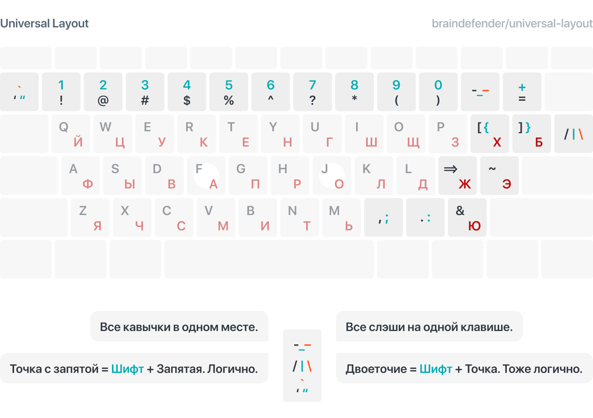
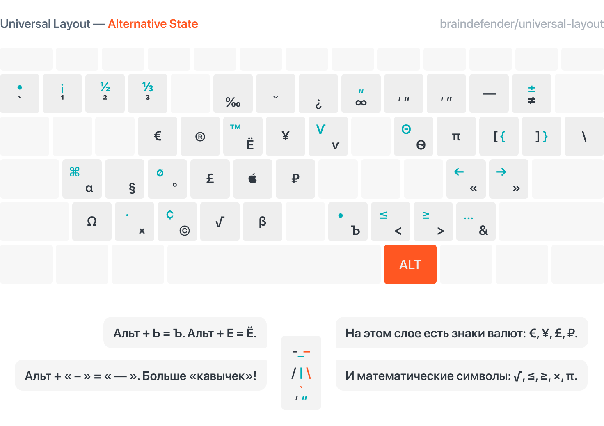

# Universal Layout English / Russian

Универсальная раскладка — пакет из английской и русской раскладок для Windows и macOS. Спроектировано для удобного использования раскладок с сохранением позиций символов.

## Что это и откуда?

Мне очень понравилась идея [универсальной раскладки](https://tonsky.livejournal.com/318571.html) Никиты Прокопова, в особенности логичное использование клавиш точки для двоеточия, а запятой для точки с запятой. 

В итоге мной была разработана своя версия английской и русской раскладок, в которых «одинаковые» символы расположены на отдельных клавишах.

Также большим плюсом для меня является лёгкий способ вводить кавычки `«` и `»`, а также ворох специальных символов на слое Alt.

## Что не так со стандартными раскладками?

> Стандартная русская раскладка проектировалась по остаточному принципу, исходя из условия, что латинскую менять нельзя. Это привело к тому, что в русской раскладке пунктуация (запятая, точка, двоеточие, точка с запятой, кавычка, вопрос) расположены в других местах, нежели в английской. А кое-что в русской раскладке и вовсе нельзя набрать, например, одинарную кавычку.
>
> — Nikita Prokopov (@tonsky)

Подробнее тут: [Правильная русская клавиатура](https://tonsky.livejournal.com/318571.html) и [Артемий Лебедев. Трагедия запятой](https://www.artlebedev.ru/kovodstvo/sections/105/)

## Как это решает универсальная раскладка?

- Вся пунктуация стоит на одних и тех же местах в обеих раскладках,
- Цифры вводятся через shift, а символы — просто так,
- `[`, `]`, `{`, `}` и `'` теперь можно ввести и на русской раскладке.

## К чему стоит привыкнуть?

- Буквы Б и Ю поменяли своё расположение
- Все стандартные кавычки и все слэши вынесены в отдельные клавиши.
- Ъ, Ё, ₽, € вынесены на слой с модификатором **Alt**

## Третий слой (Alt + \<key\>)

## Как установить?

Скачать последнюю версию для нужной системы.

### Windows 10

1. В папках `windows/unieng` и `windows/unirus` запустить файлы `setup.exe`.
2. _(Опционально)_ Удалить старые раскладки в меню `Настройки / Время и Язык / Язык / Предпочитаемые языки`.
3. _(Опционально)_ Установить раскладки в качестве стандартных для Экрана входа Windows в меню `Административные языковые параметры / Копировать параметры`.

### macOS

1. Файл `Universal.bundle` положить в `~/Library/Keyboard Layouts`.
2. Выбрать соответствующие раскладки в `System Preferences > Keyboard > Input Sources`
3. _(Опционально)_ Удалить стандартные раскладки. Чтобы удалить стандартную US раскладку нужно сначала добавить японскую, удалить английскую и затем удалить японскую.
4. Перезайти в систему.

## Дополнительно

В папке addons можно найти .ahk-скрипт для [AutoHotkey](https://www.autohotkey.com). Он перенесёт медиа-клавиши на функциональный ряд, а F1 … F12 на слой с модификатором fn / menu.

## Источники

Большое спасибо Никите Прокопову [@nikitonsky](https://twitter.com/nikitonsky) за идею и ресурсы.

Репозиторий оригинальной Universal Layout на [GitHub](https://github.com/tonsky/Universal-Layout/).

А также [создателю kbdasm](https://habr.com/ru/post/301882/) — Ассемблера и дизассемблера клавиатурных раскладок Windows

Репозиторий дизассемблера раскладок на [GitHub](https://github.com/grompe/kbdasm).
