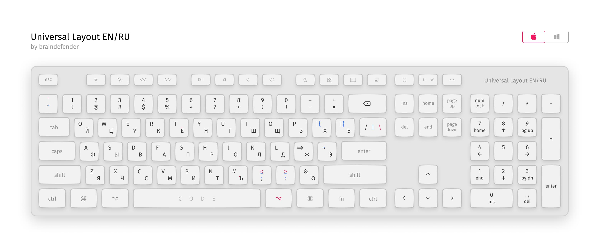
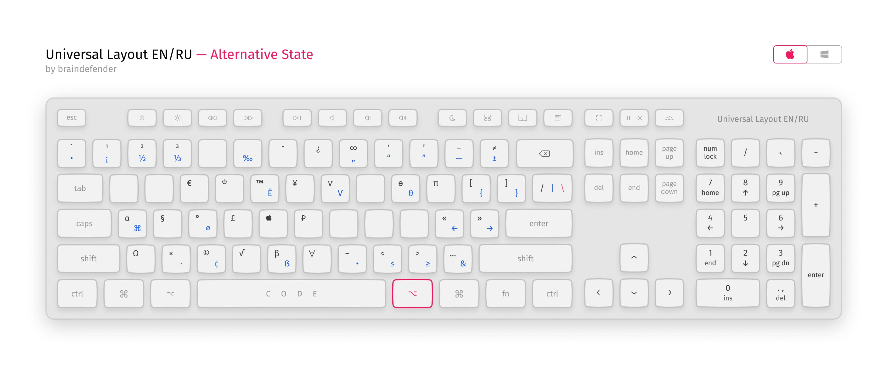

# Universal Layout EN / RU

Русская и английская раскладки, адаптированные для удобного совместного использования.

## Дисклеймер

Мне очень понравилась идея [универсальной раскладки](https://tonsky.livejournal.com/318571.html) Никиты Прокопова, в особенности необычное использование клавиш для точки и запятой.

Жаль, что эта раскладка существовала только под macOS, что неудобно для тех, кто использует Windows и macOS одновременно.

Все права принадлежат тем, кто их заслуживает.

## Что не так со стандартными раскладками?

> Стандартная русская раскладка проектировалась по остаточному принципу, исходя из условия, что латинскую менять нельзя. Это привело к тому, что в русской раскладке пунктуация (запятая, точка, двоеточие, точка с запятой, кавычка, вопрос) расположена на других местах, нежели в английской. А кое-что в русской раскладке и вовсе нельзя набрать, например, одинарную кавычку.
>
> — Nikita Prokopov (@tonsky)

Действительно, очень сильно этот хаос демонстрирует следующая картинка:

Подробнее тут: [Правильная русская клавиатура](https://tonsky.livejournal.com/318571.html) и [Артемий Лебедев. Трагедия запятой](https://www.artlebedev.ru/kovodstvo/sections/105/)

## Какие в этом плюсы?

- Вся пунктуация стоит на одних и тех же местах в обеих раскладках
- Цифры вводятся через shift, а символы — просто так
- `[`, `]`, `{` и `}` теперь можно ввести и на русской раскладке

## К чему стоит привыкнуть?

- Буквы Б и Ю поменяли своё расположение
- Все стандартные кавычки вынесены в одну кнопку.
- Ъ, Ё, ₽, € вынесены на слой с модификатором **Alt**

## Как установить?

Скачать последнюю версию для нужной системы.

### Windows 10

1. Файлы `layouts/kbdunieng.dll` и `layouts/kbdunirus.dll` скопировать в папку `C:/Windows/System32` и установить файлы реестра `install_uni_eng.reg` и `install_uni_rus.reg`.
2. Проверить и выбрать раскладки в `Параметры > Время и язык > Регион и язык` для каждого языка ввода.
3. _(Опционально)_ Удалить стандартные раскладки в этих же меню и применить `Remove Autoload Default Layouts.reg` для того, чтобы они не появлялись вновь при загрузке системы. _(Работает не у всех)_

### macOS

1. Файл `Universal.bundle` положить в `~/Library/Keyboard Layouts`.
2. Выбрать соответствующие раскладки в `System Preferences > Keyboard > Input Sources`
3. _(Опционально)_ Удалить стандартные раскладки. Чтобы удалить стандартную US раскладку нужно сначала добавить японскую, удалить английскую и затем удалить японскую.
4. Перезайти в систему.

## Дополнительно

В папке addons можно найти .ahk-скрипт для [AutoHotkey](https://www.autohotkey.com). Он перенесёт медиа-клавиши на функциональный ряд, а F1 … F12 на слой с модификатором fn / menu.

## Источники

Большое спасибо Никите Прокопову [@nikitonsky](https://twitter.com/nikitonsky) за идею и ресурсы.

Репозиторий оригинальной Universal Layout на [GitHub](https://github.com/tonsky/Universal-Layout/). R8!

А также [создателю kbdasm](https://habr.com/ru/post/301882/) — Ассемблера и дизассемблера клавиатурных раскладок Windows

Репозиторий дизассемблера раскладок на [GitHub](https://github.com/grompe/kbdasm). Also R8!
