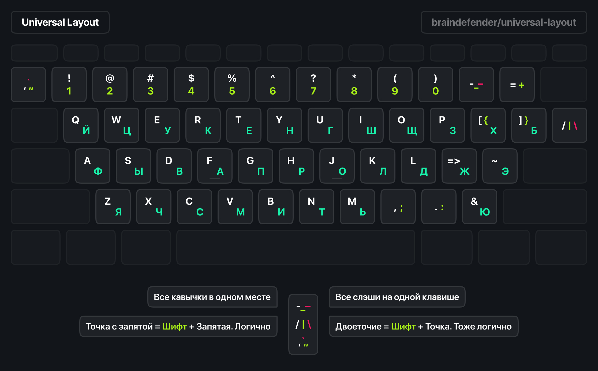
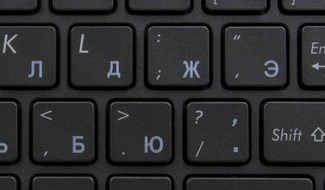
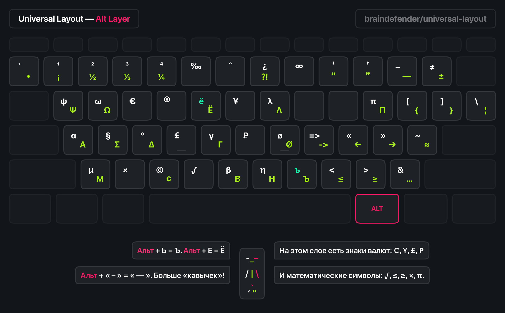
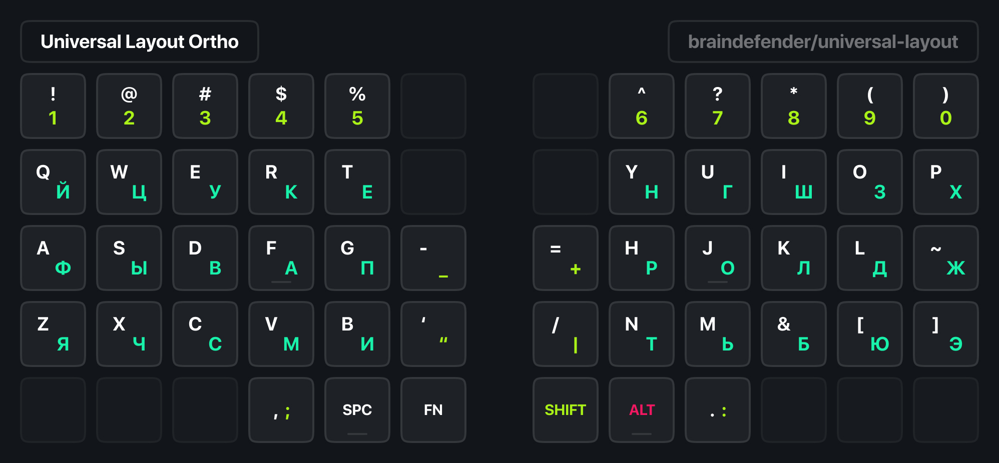
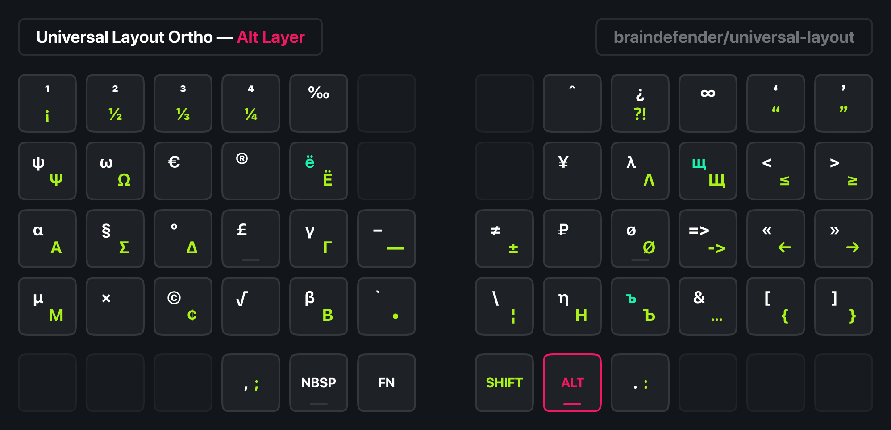
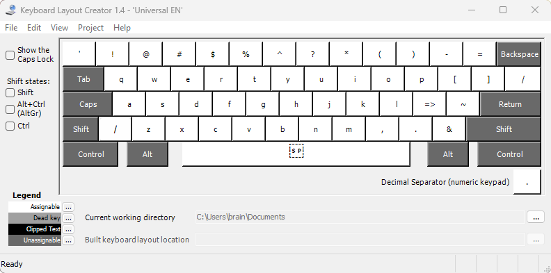
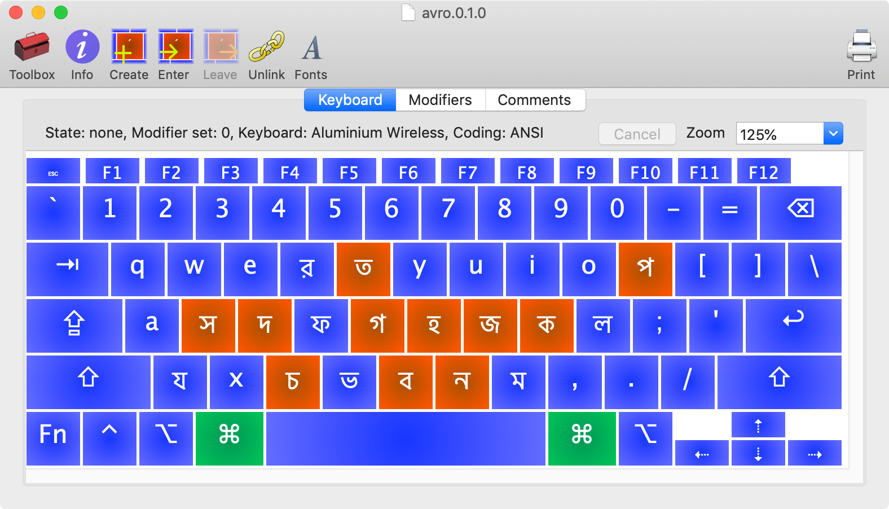

# Universal Layout

Универсальная раскладка — пакет комбинированной русской и английской раскладки для Windows, Linux и macOS. Раскладка спроектирована для повышенного удобства ввода различных символов. Присутствует также версия для ортолинейных и сплит-клавиатур.



## Содержание

- [Universal Layout](#universal-layout)
  - [Содержание](#содержание)
  - [Происхождение](#происхождение)
  - [Что не так со стандартными раскладками?](#что-не-так-со-стандартными-раскладками)
  - [Как это решает универсальная раскладка?](#как-это-решает-универсальная-раскладка)
  - [К чему придётся привыкнуть?](#к-чему-придётся-привыкнуть)
  - [Слой специальных символов (AltGr + \<key\>)](#слой-специальных-символов-altgr--key)
  - [Версия для ортолинейных клавиатур](#версия-для-ортолинейных-клавиатур)
  - [О минусах и багах](#о-минусах-и-багах)
  - [Как установить?](#как-установить)
    - [Windows 10/11](#windows-1011)
    - [Linux](#linux)
    - [macOS](#macos)
  - [Разработка](#разработка)
    - [Windows 10/11](#windows-1011-1)
    - [Linux](#linux-1)
    - [macOS](#macos-1)
  - [Благодарности](#благодарности)

## Происхождение

Мне очень понравилась идея [универсальной раскладки](https://tonsky.livejournal.com/318571.html) Никиты Прокопова, в особенности логичное использование клавиш точки для двоеточия, а запятой для точки с запятой.

В итоге мной была разработана своя версия английской и русской раскладок, в которых «одинаковые» символы расположены на отдельных клавишах.

Также большим плюсом для меня является лёгкий способ вводить кавычки `«` и `»`, а также ворох специальных символов на слое <kbd>AltGr</kbd>.

## Что не так со стандартными раскладками?



> Стандартная русская раскладка проектировалась по остаточному принципу, исходя из условия, что латинскую менять нельзя. Это привело к тому, что в русской раскладке пунктуация (запятая, точка, двоеточие, точка с запятой, кавычка, вопрос) расположены в других местах, нежели в английской. А кое-что в русской раскладке и вовсе нельзя набрать, например, одинарную кавычку.
>
> — Nikita Prokopov (@tonsky)

Подробнее почитать о проблемах стандартных раскладок можно здесь:

- [Правильная русская клавиатура](https://tonsky.livejournal.com/318571.html)
- [Артемий Лебедев. Трагедия запятой](https://www.artlebedev.ru/kovodstvo/sections/105/).

## Как это решает универсальная раскладка?

- Вся пунктуация стоит на одних и тех же местах как для русского, так и для английского языка
- Есть несколько клавиш, которые собрали в себя все похожие символы, которые раньше были разбросаны по клавиатуре: <kbd>'"`</kbd>, <kbd>/|\\</kbd>, <kbd>-\_—</kbd> и <kbd>=+≠±</kbd>
- <kbd>[</kbd> <kbd>]</kbd> <kbd>{</kbd> <kbd>}</kbd> и <kbd>'</kbd> теперь можно ввести и на русской раскладке

## К чему придётся привыкнуть?

- Раскладка объединяет в себе русскую и английскую раскладки, которые переключаются по клавише <kbd>Caps Lock</kbd>. Правда, для Windows есть Standard версия от [moigagoo](https://github.com/moigagoo) с раздельными раскладками, если <kbd>Caps Lock</kbd> для вас непривычен.
- На месте цифр расположены символы, и наоборот, на месте символов — цифры. К примеру, <kbd>7</kbd> = <kbd>Shift</kbd> + <kbd>?</kbd>
- В стандартной версии буквы Б и Ю поменяли своё расположение. В версии для ортолинейных клавиатур изменений ещё больше, подробнее о них [написано ниже](#версия-для-ортолинейных-клавиатур)
- <kbd>Ъ</kbd> <kbd>Ё</kbd> <kbd>₽</kbd> <kbd>€</kbd> вынесены на слой с модификатором <kbd>Alt</kbd>.

## Слой специальных символов (AltGr + \<key\>)



## Версия для ортолинейных клавиатур




Для ортолинейных клавиатур буквы русского и английского алфавита помещены в сетку 2×15. Для этого пришлось пожертвовать тремя буквами русского алфавита, которые не уместились в сетку. Однако, они расположены весьма логично и запоминаются мнемонически:

<kbd>Ё</kbd> = <kbd>Alt</kbd> + <kbd>Е</kbd> <br>
<kbd>Ъ</kbd> = <kbd>Alt</kbd> + <kbd>Ь</kbd> <br>
<kbd>Щ</kbd> = <kbd>Alt</kbd> + <kbd>Ш</kbd> <br>

Также, эта раскладка используется в [36-клавишной раскладке Wellum](https://github.com/braindefender/wellum)

## О минусах и багах

- Если вы используете RDP или VNC, то раскладка в них работать не будет. Если очень хочется, можно поставить её и на удалённые машины, но это опция зачастую недоступна.
- Некоторые приложения Windows принудительно добавляют дефолтную раскладку, которая была установлена по-умолчанию в системе. При этом, раскладка не отображается в списке доступных для языка. Чтобы это исправить, надо вручную добавить дефолтную раскладку и удалить.
- Есть [проблемы в работе AltGr](#баги) на Linux. Их можно исправить, но в каждом конкретном случае нужно будет разбираться отдельно. К сожалению, любой софт не идеален. Например, Linux не поддерживает ввод лигатур (<kbd>Alt</kbd> + <kbd>K</kbd> = <kbd>=></kbd>).

> Не смотря на все эти баги, я пользуюсь этой раскладкой более 5 лет и удобство от её использования перевешивает все описанные проблемы. Единственная система, где раскладка работает идеально — macOS.

## Как установить?

В папке `layouts` репозитория есть две версии (Standard и Ortho) для Windows, Linux и macOS.

### Windows 10/11

> Для Windows также есть Standard версия от [moigagoo](https://github.com/moigagoo) с двумя различными раскладками для RU (`UniRU`) и EN (`UniEN`) локали соответственно. Она может понадобиться вам, если вы хотите переключать язык стандартным способом, а не через <kbd>Caps Lock</kbd>. Также, это позволит видеть какая именно раскладка сейчас активна.

1. Запустить `setup.exe` нужной версии и дождаться установки.
2. Установить раскладку в настройках системы: `Настройки` > `Время и язык` > `Язык и регион` > `Английский (США)` > `Меню три точки` > `Языковые параметры` > `Добавить раскладку`
3. _(Опционально)_ Удалить из списка стандартную раскладку для английского языка. В случае, если система установлена на английском языке, то можно целиком удалить русский язык на предыдущем экране.
4. _(Опционально)_ Установить раскладку в качестве стандартной для Экрана входа Windows в меню `Административные языковые параметры` > `Копировать параметры`.
5. Перезагрузить систему — лишним не будет.

### Linux

> Люблю линукс за то, что можно всё настраивать. Правда тебе **приходится** всё настраивать.

1. Для NixOS: положить universal (или universal_ortho) рядом с конфигом (или указать путь в symbolsFile до него). Пример:

   ```nix
   {...}: {
      services.xserver = {
        layout = "universal";

        extraLayouts = {
          universal = {
            description = "Universal Layout";
            languages = ["eng"];
            symbolsFile = ./universal;
          };
        };
      };
   }
   ```

2. Для остальных: поместить содержимое папки `layouts/Linux/xkb` в `~/.config/xkb`.
3. Далее, способ установки зависит от окружения рабочего стола (Desktop Environment):

   - GNOME: В списке языков добавить Russian и English. В Gnome Tweaks в настройках клавиатуры включить опцию Universal Layout. Но это может работать криво: на Wayland может появляться ещё одна группа с дефолтной английской раскладкой.
   - i3wm, herbstluftwm и другие WM на X Window System: добавить в автозапуск следующие команды:
     ```sh
     xkbcomp $HOME/.config/xkb/symbols/universal $DISPLAY 2>&1
     ```
   - Для sway, hyprland и других WM на Wayland: ищите инструкцию в документации своего оконного менеджера.

### macOS

1. Файл `layouts/macOS/Universal.bundle` скопировать в `~/Library/Keyboard Layouts`.
2. Перезагрузиться и перезайти в систему.
3. Выбрать желаемую раскладку в `Настройки системы > Клавиатура > Источники ввода`. Она будет в разделе с Русской раскладкой.
4. _(Опционально)_ Удалить стандартные раскладки русского и английского языка. 
> Для этого в файле `~/Library/Preferences/com.apple.HIToolbox.plist` удалить XML ноды, соответствующие стандартным раскладкам.

## Разработка

### Windows 10/11

Для изменения или создания раскладок под Windows понадобится программа [Microsoft Keyboard Layout Creator](https://www.microsoft.com/en-us/download/details.aspx?id=102134).

> EXE'шник установщика есть и в репозитории в папке `layouts/Windows/software/msklc.exe`.

Программа древняя и давно не обновлялась Microsoft, поэтому для его работы нужен [.NET Framework 2.0](https://www.microsoft.com/ru-ru/download/details.aspx?id=6041).



С помощью неё можно открыть и редактировать файлы формата `.klc`, а также создать пакет для установки раскладки (`Project > Build DLL and Setup Package`).

> Важно! Поле `Name` в `Project > Properties` должно быть уникальным для системы и содержать не более 8 символов!

### Linux

Для изменения или создания раскладок под Linux я не находил GUI-приложений. Файлы раскладок никак не компилируются, поэтому для их редактирования вам понадобится [любой](https://www.vim.org) [текстовый](https://www.gnu.org/software/emacs/) [редактор](https://helix-editor.com).

О том как пользоваться XKB можно почитать на [ArchWiki](https://wiki.archlinux.org/title/X_keyboard_extension).

### macOS

Для изменения или создания раскладок под macOS понадобится программа [Ukelele](https://software.sil.org/ukelele/). 



С помощью неё можно открыть файлы формата `.bundle`, установить раскладку напрямую в систему или экспортировать в файл.

## Благодарности

Никите Прокопову [@nikitonsky](https://twitter.com/nikitonsky) за оригинальную идею и ресурсы. Репозиторий оригинальной Universal Layout на [GitHub](https://github.com/tonsky/Universal-Layout/).

Дмитрию Ковалёву [@devpew](https://devpew.com/blog/) за [хорошие видео](https://www.youtube.com/@johenews21/videos) о кастомных механических и раздельных эргономичных клавиатурах.

Русскоязычному сообществу эргономичных раскладок и клавиатур [@klavaorgwork](https://t.me/klavaorgwork) за помощь и обратную связь.
